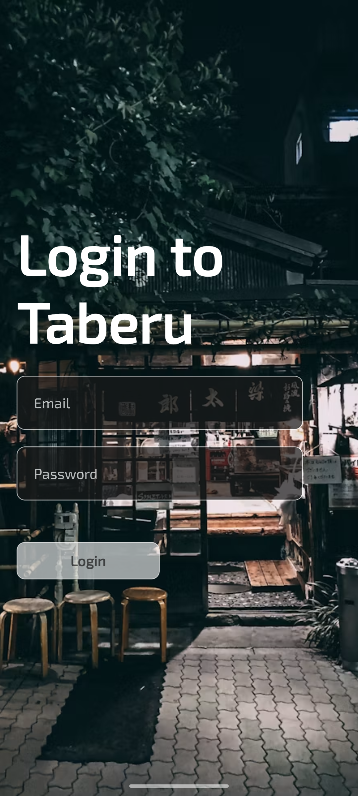
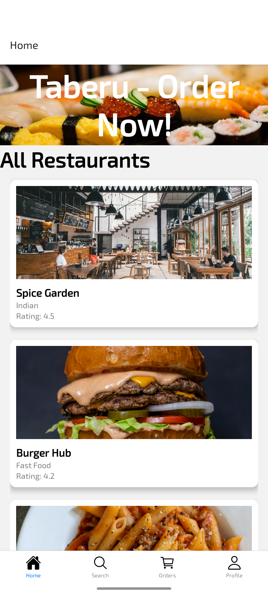
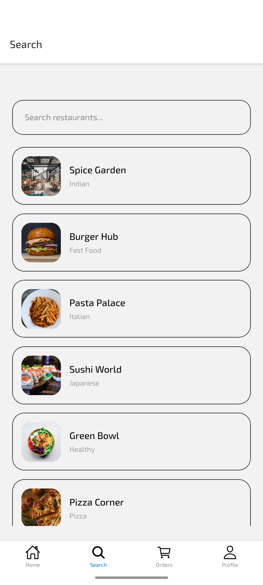
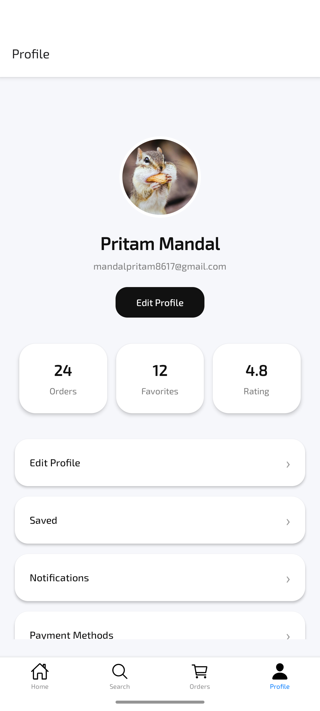

# 🍽️ Taberu - Food Delivery UI

A modern, responsive food delivery mobile application built with React Native and Expo. Taberu provides users with a seamless experience to browse restaurants, search for food, track orders, and manage their profile.

---

## 📋 Table of Contents

- [Features](#-features)
- [Technology Stack](#-technology-stack)
- [Project Structure](#-project-structure)
- [Screenshots](#-screenshots)
- [Installation](#-installation)
- [Running the App](#-running-the-app)
- [Project Architecture](#-project-architecture)
- [Available Screens](#-available-screens)

---

## ✨ Features

- **User Authentication**: Secure login and registration system using AsyncStorage
- **Home Screen**: Browse restaurants with ratings and categories
- **Search Functionality**: Search for restaurants and food items
- **Orders Tracking**: View and manage your orders
- **User Profile**: Manage profile information, saved items, and preferences
- **Bottom Tab Navigation**: Easy navigation between main sections
- **Drawer Navigation**: Additional menu options
- **Responsive Design**: Optimized for all screen sizes
- **Beautiful UI**: Modern and intuitive user interface

---

## 🛠️ Technology Stack

| Technology | Version | Purpose |
|-----------|---------|---------|
| **React Native** | 0.83.6 | Cross-platform mobile framework |
| **Expo** | ~55.0.26 | Development platform for React Native |
| **React** | 19.2.0 | JavaScript library for building UIs |
| **TypeScript** | ~5.9.2 | Type-safe JavaScript |
| **React Navigation** | ~7.x | Navigation library |
| **Async Storage** | 2.2.0 | Persistent local storage |
| **Expo Icons** | ^15.0.2 | Icon library (Ionicons) |
| **React Native Reanimated** | 4.2.1 | Animation library |
| **React Native Gesture Handler** | ~2.30.0 | Gesture handling |

---

## 📁 Project Structure

```
food-delivery-ui/
├── src/
│   ├── navigation/
│   │   ├── RootNavigator.tsx        # Main navigation logic
│   │   ├── AuthNavigator.tsx        # Authentication flow
│   │   ├── DrawerNavigator.tsx      # Drawer menu
│   │   └── ButtomTabs.tsx           # Bottom tab navigation
│   └── screens/
│       ├── HomeScreen.tsx           # Main home screen with restaurants
│       ├── LoginScreen.tsx          # User login
│       ├── OnboardingScreen.tsx     # Initial onboarding
│       ├── SearchScreen.tsx         # Search for restaurants/food
│       ├── OrdersScreen.tsx         # Order history and tracking
│       └── ProfileScreen.tsx        # User profile and settings
├── assets/                          # App icons and splash screens
├── public/                          # Screenshots and images
├── App.tsx                          # Root component
├── index.ts                         # App entry point
├── app.json                         # Expo configuration
├── package.json                     # Dependencies
├── tsconfig.json                    # TypeScript configuration
└── Readme.md                        # This file
```

---

## 📸 Screenshots

<div>








</div>

---

## 📦 Installation

### Prerequisites
- Node.js (v16 or higher)
- npm or yarn
- Expo CLI: `npm install -g expo-cli`

### Setup Steps

1. **Clone the repository** (if using git):
   ```bash
   git clone <repository-url>
   cd food-delivery-ui
   ```

2. **Install dependencies**:
   ```bash
   npm install
   # or
   bun install
   ```

3. **Install Expo CLI** (if not already installed):
   ```bash
   npm install -g expo-cli
   ```

---

## 🚀 Running the App

### Start Development Server
```bash
npm start
# or
yarn start
# or using bun
bunx expo start -c
```

### Run on Specific Platform

**Android:**
```bash
npm run android
```

**iOS:**
```bash
npm run ios
```

**Web:**
```bash
npm run web
```

### Using Expo Go
1. Install Expo Go app on your mobile device
2. Scan the QR code from the terminal
3. App will load in Expo Go

---

## 🏗️ Project Architecture

### Navigation Flow

```
RootNavigator
├── AuthNavigator (Not logged in)
│   └── OnboardingScreen → LoginScreen
└── BottomTabs (Logged in)
    ├── HomeScreen
    ├── SearchScreen
    ├── OrdersScreen
    └── ProfileScreen
```

### Authentication
- Uses **AsyncStorage** for persistent user data
- Login credentials stored locally
- User state managed at RootNavigator level
- Automatic redirect based on authentication status

### Data Management
- **AsyncStorage**: Stores user credentials and preferences
- **Restaurant Data**: Hardcoded with sample data from Unsplash
- **Profile Data**: User information with avatar, ratings, and order history

---

## 📱 Available Screens

### 1. **Onboarding Screen**
- Welcome screen with app branding
- Get Started button to proceed to login

### 2. **Login Screen**
- Email and password input fields
- Form validation
- AsyncStorage integration for user persistence

### 3. **Home Screen**
- Grid/list of restaurants
- Restaurant cards with:
  - Restaurant image
  - Name
  - Rating
  - Category/Tag
- Images sourced from Unsplash API

### 4. **Search Screen**
- Search functionality for restaurants and food
- Filter and sort options
- Quick access to favorite restaurants

### 5. **Orders Screen**
- View order history
- Real-time order tracking
- Order status updates
- Reorder functionality

### 6. **Profile Screen**
- User information display
- Profile picture
- Menu options:
  - Edit Profile
  - Saved Items
  - Notifications
  - Payment Methods
  - Privacy Settings
  - Logout

---

## 🎨 UI/UX Features

- **Modern Design**: Clean and intuitive interface
- **Consistent Branding**: Color scheme: Light theme with accent colors
- **Icon System**: Ionicons for consistent iconography
- **Responsive Layout**: Adapts to different screen sizes
- **Safe Area Support**: Proper handling of notches and safe areas
- **Status Bar Customization**: Light content on onboarding screen

---

## 🔧 Configuration

### Expo Configuration (app.json)
- App name: `food-delivery-ui`
- Version: `1.0.0`
- Portrait orientation
- Light UI style
- Custom splash screen and icons
- Platform-specific configurations for iOS and Android

### TypeScript Configuration
- Strict mode enabled
- Based on Expo's TypeScript base configuration

---

## 📝 Available Scripts

```bash
npm start        # Start development server
npm run android  # Run on Android emulator/device
npm run ios      # Run on iOS simulator/device
npm run web      # Run on web browser
```

---

## 🔐 Security Notes

⚠️ **Warning**: This is a UI demonstration project. In production:
- Use secure backend authentication (JWT, OAuth, etc.)
- Never store sensitive credentials in AsyncStorage without encryption
- Implement proper password hashing
- Use HTTPS for all API communications
- Add proper input validation and sanitization

---

## 📄 License

This project is open source and available under the MIT License.

---

## 👨‍💻 Developer

**Pritam Mandal**

---

## 📞 Support

For issues or questions, please create an issue in the repository.

---

**Happy Coding! 🚀**
